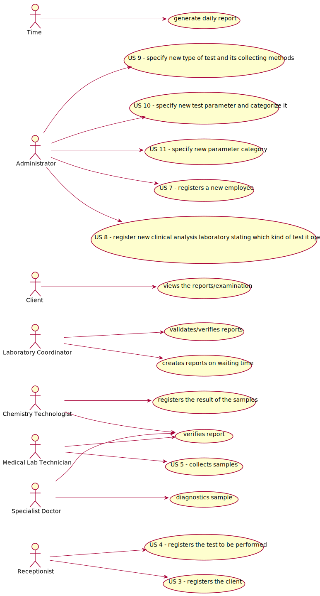

# Use Case Diagram (UCD)

**In the scope of this project, there is a direct relationship of _1 to 1_ between Use Cases (UC) and User Stories (US).**

However, be aware, this is a pedagogical simplification. On further projects and curricular units might also exist _1 to N **and/or** N to 1 relationships between US and UC.




**For each UC/US, it must be provided evidences of applying main activities of the software development process (requirements, analysis, design, tests and code). Gather those evidences on a separate file for each UC/US and set up a link as suggested below.**

# Use Cases / User Stories
| UC/US  | Description                                                               |                   
|:----|:------------------------------------------------------------------------|
| US1 | [ShortNameOfUS1](US1.md)   |
| US2 | [ShortNameOfUS2](US2.md)  |
| US3 | [Register the client](US3.md)|
| US4 | [registers the test to be performed](US4.md)|
| US5 | [Collect samples](US5.md)|
| US6 | [ShortNameOfUS6](US6.md) |
| US7 | [Registers a new employee](US7.md)|
| US8 | [Register a new clinical analysis laboratory stating which kind of test(s) it operates](US8.md)|
| US9 | [Specify a new type of test and its collecting methods](US9.md)|
| US10 | [Specify a new parameter and categorize it](US10.md)|
| US11 | [Specify a new parameter category](US11.md)|
| … | … |
| US326 | [ShortNameOfUS4](US326.md)|

