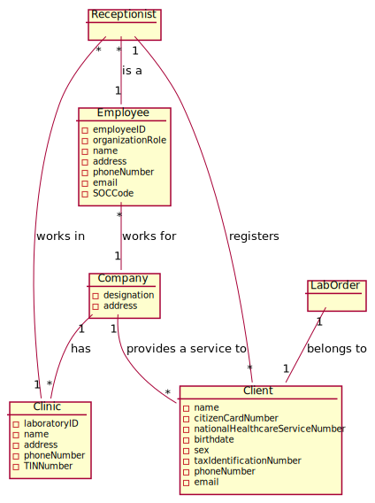
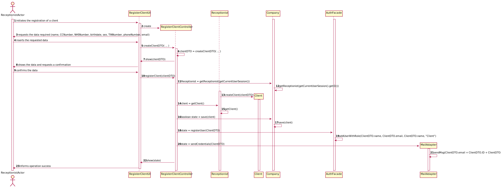
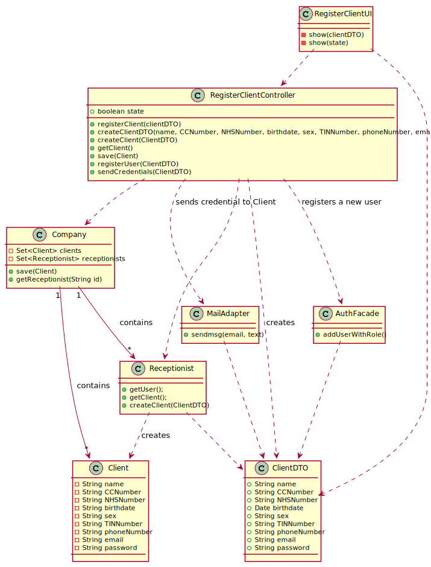

# US US3 - Register Client

## 1. Requirements Engineering

### 1.1. User Story Description

As a receptionist of the clinic, I want to register a client.

### 1.2. Customer Specifications and Clarifications 

The "auth" component available  on the repository must be reused (without modifications).

The application must validate and should not accept clients who have more than 150 years of age.
It is good to have old people using our services, but 150 years it's too much and it may be a typo.
The password should be randomly generated. It should have ten alphanumeric characters
The maximum length of the String with the name of the Client should be no more than 35 characters.
TIN should be a 10 digit number.
Citizen Card: 16 digit number.
NHS: 10 digit number.
Birth day - in which format: DD/MM/YY
Sex - should only be Male/Female or include more options. Male/Female
Phone number: 11 digit number
The sex is opcional. All other fields are required. 

The e-mail address and phone number should be unique for each user. The system should present a message informing about the error and asking for a different phone number.

### 1.3. Acceptance Criteria

The client must become a system user.

### 1.4. Found out Dependencies

Receptionist needs to be a functinal actor in the system.

### 1.5 Input and Output Data

The receptionist will need to input the clients information: name, Citizen Card Number, NHS Number, birthdate, sex, TINNumber, phone Number, email and Lab Order

The output should be a registered client that will have access to the system via authentication.
Each client receives an e-mail informing that the registration was successful and that he can start to use the system. The e-mail includes the user password.

### 1.6. System Sequence Diagram (SSD)

### 1.7 Other Relevant Remarks

This US is held when a client comes for the first time.

## 2. OO Analysis

### 2.1. Relevant Domain Model Excerpt 
*In this section, it is suggested to present an excerpt of the domain model that is seen as relevant to fulfill this requirement.* 

### 2.2. Other Remarks

*Use this section to capture some aditional notes/remarks that must be taken into consideration into the design activity. In some case, it might be usefull to add other analysis artifacts (e.g. activity or state diagrams).* 

## 3. Design - User Story Realization 

### 3.1. Rationale

**The rationale grounds on the SSD interactions and the identified input/output data.**

| Interaction ID | Question: Which class is responsible for... | Answer  | Justification (with patterns)  |
|:-------------  |:--------------------- |:------------|:---------------------------- |
| Step 1  		 |	... instantiating a new Client?	 |   Receptionist          |  Creator: Receptionist records instances of Clients           |
| Step 2  		 |		n/a					 |             |                              |
| Step 3  		 |	... saving the input data?		 |      Client       | IE: The object created in step 1 has its own data                             |
| Step 4.1  		 |	... validating the data locally?						 |    Client         | IE: knows its own data                             |
| Step 4.2  		 |	... validating the data globally?						 |    Company         | IE: knows all Client objects                             |
| Step 5  		 |	... saving the created Client?						 |    Company         |    IE: records all client objects                          |
| Step 6  		 |	... informing operation success?						 |       UI      |    IE: responsible for user interaction                         |              

### Systematization ##

According to the taken rationale, the conceptual classes promoted to software classes are: 

 * Receptionist
 * Client
 * Company

Other software classes (i.e. Pure Fabrication) identified: 
 * RegisterClientUI  
 * RegisterClientController

## 3.2. Sequence Diagram (SD)

*In this section, it is suggested to present an UML dynamic view stating the sequence of domain related software objects' interactions that allows to fulfill the requirement.* 

## 3.3. Class Diagram (CD)

*In this section, it is suggested to present an UML static view representing the main domain related software classes that are involved in fulfilling the requirement as well as and their relations, attributes and methods.*

# 4. Tests 
*In this section, it is suggested to systematize how the tests were designed to allow a correct measurement of requirements fulfilling.* 

**_DO NOT COPY ALL DEVELOPED TESTS HERE_**

**Test 1:** Check that it is not possible to create an instance of the Example class with null values. 

	@Test(expected = IllegalArgumentException.class)
		public void ensureNullIsNotAllowed() {
		Exemplo instance = new Exemplo(null, null);
	}

*It is also recommended to organize this content by subsections.* 

# 5. Construction (Implementation)

*In this section, it is suggested to provide, if necessary, some evidence that the construction/implementation is in accordance with the previously carried out design. Furthermore, it is recommeded to mention/describe the existence of other relevant (e.g. configuration) files and highlight relevant commits.*

*It is also recommended to organize this content by subsections.* 

# 6. Integration and Demo 

*In this section, it is suggested to describe the efforts made to integrate this functionality with the other features of the system.*

# 7. Observations

*In this section, it is suggested to present a critical perspective on the developed work, pointing, for example, to other alternatives and or future related work.*

