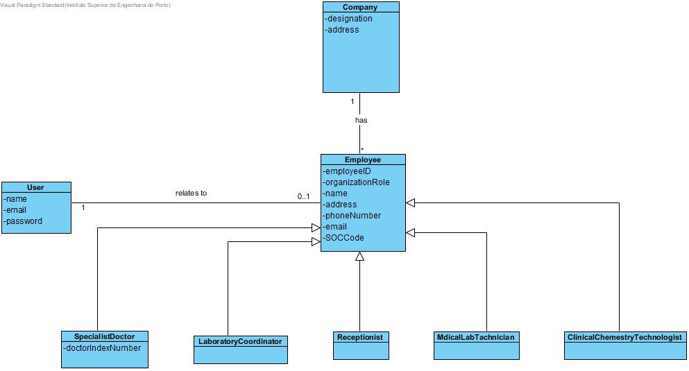
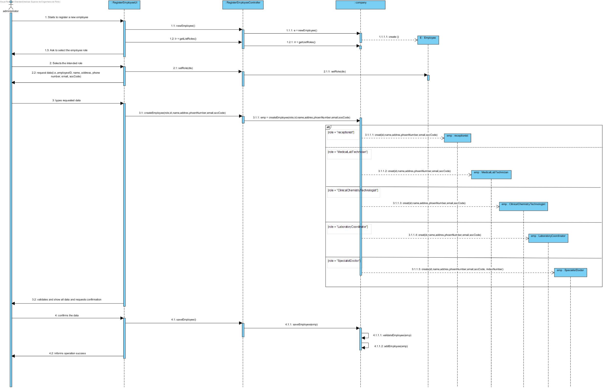

# US 7 -  As an administrator, I want to register a new employee

## 1. Requirements Engineering

### 1.1. User Story Description

As an administrator, I want to register a new employee

### 1.2. Customer Specifications and Clarifications 

#### From the client clarification:
Each employee is characterized by having a unic employee ID, doctor index number, organization role, name, address, phone number, email, SOC code.

### 1.3. Acceptance Criteria

AC1: All required fields must be filled in.

AC2: When registing a employee that alrady exists , the system must reject such operation.

### 1.4. Found out Dependencies

There is no dependencies.

### 1.5 Input and Output Data
#### Input Data:
	
	 	.Typed data
			. A employee ID,
			. Docter ’ndex number
			. A organization role,
			. A name,
			. A address,
			. A phone number 
			. A email,
			. A SOC code.
#### Output Data:

			. Success of the operation

### 1.6. System Sequence Diagram (SSD)

### 1.7 Other Relevant Remarks

## 2. OO Analysis

### 2.1. Relevant Domain Model Excerpt 

### 2.2. Other Remarks

*Use this section to capture some aditional notes/remarks that must be taken into consideration into the design activity. In some case, it might be usefull to add other analysis artifacts (e.g. activity or state diagrams).* 

## 3. Design - User Story Realization 

### 3.1. Rationale

**The rationale grounds on the SSD interactions and the identified input/output data.**

| Interaction ID | Question: Which class is responsible for... | Answer  | Justification (with patterns)  |
|:-------------  |:--------------------- |:------------|:---------------------------- |
| Step 1 The Administrator starts to register a new employee |What class interacts with the user?| RegisterEmployeeUI | Pure Fabrication, because it is not justified to assign this responsibility to any class that exists in the Domain Model.                             |
| | Which class coordinates the US? | RegisterEmployeeController | Controller |
| | What class creates employee? | Company | Creator |
| Step 2 The system request data(employeeID,doctor index number organization role, name, address, phone number, email, SOC code) |							 |             |                              |
| Step 3 The Administrator types requested data |	Where are the entered data stored? | Employee | Information Expert (IE)  |
| Step 4 The system validates and show all data and requests confirmation | What class validates the data of the employee (local validation)? | Employee | IE: Employee has his own data |
| | What class validates Employee data (global validation)? | Company |  IE: The Company contains / adds Employee |
| Step 5 The Administrator confirms the data |							 |             |                              |
| Step 6 The system records the data and informs the administrator of the success of the operation.| What class does the specified / created Employee keep? | Company | IE. In the MD, the Company contains / aggregates Employees |              
| | What class notifies? | RegisterEmployeeUI |

### Systematization ##

According to the taken rationale, the conceptual classes promoted to software classes are: 

 * Company
 * Employee

Other software classes (i.e. Pure Fabrication) identified: 

 * RegisterEmployeeUI  
 * RegisterEmployeeController

## 3.2. Sequence Diagram (SD)

*In this section, it is suggested to present an UML dynamic view stating the sequence of domain related software objects' interactions that allows to fulfill the requirement.* 

## 3.3. Class Diagram (CD)

*In this section, it is suggested to present an UML static view representing the main domain related software classes that are involved in fulfilling the requirement as well as and their relations, attributes and methods.*

# 4. Tests 
*In this section, it is suggested to systematize how the tests were designed to allow a correct measurement of requirements fulfilling.* 

**_DO NOT COPY ALL DEVELOPED TESTS HERE_**

**Test 1:** Check that it is not possible to create an instance of the Example class with null values. 

	@Test(expected = IllegalArgumentException.class)
		public void ensureNullIsNotAllowed() {
		Exemplo instance = new Exemplo(null, null);
	}

*It is also recommended to organize this content by subsections.* 

# 5. Construction (Implementation)

*In this section, it is suggested to provide, if necessary, some evidence that the construction/implementation is in accordance with the previously carried out design. Furthermore, it is recommeded to mention/describe the existence of other relevant (e.g. configuration) files and highlight relevant commits.*

*It is also recommended to organize this content by subsections.* 

# 6. Integration and Demo 

*In this section, it is suggested to describe the efforts made to integrate this functionality with the other features of the system.*

# 7. Observations

*In this section, it is suggested to present a critical perspective on the developed work, pointing, for example, to other alternatives and or future related work.*

