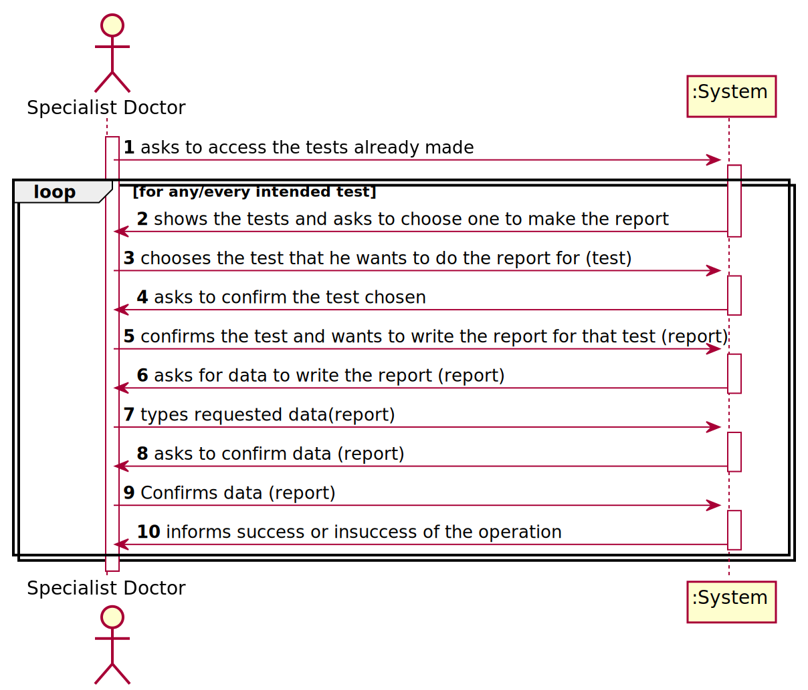
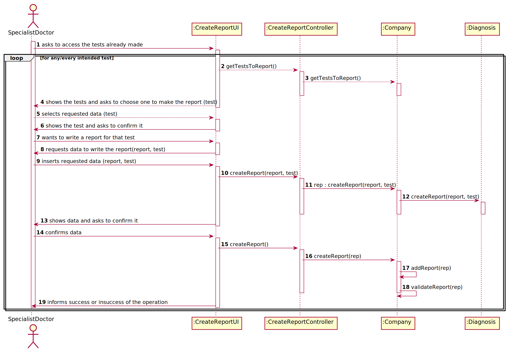

# US 14

## 1. Requirements Engineering

*In this section, it is suggested to capture the requirement description and specifications as provided by the client as well as any further clarification on it. It is also suggested to capture the requirements acceptance criteria and existing dependencies to other requirements. At last, identfy the involved input and output data and depicted an Actor-System interaction in order to fulfill the requirement.*


### 1.1. User Story Description

As a specialist doctor, I intend to make the diagnosis and write a report for a
given test.

### 1.2. Customer Specifications and Clarifications
*Insert here any related specification and/or clarification provided by the client together with **your interpretation**. When possible, provide a link to such specifications/clarifications.*

From the document:

"After completing the chemical analysis, the results of all chemical analyses are analysed by a
specialist doctor who makes a diagnosis and writes a report that afterwards will be delivered to the
client."
"After the specialist doctor has completed the diagnosis, the results of the clinical analyses and the
report become available in the system and must be validated by the laboratory coordinator"


From the client clarifications:

"Q: Is there a limit of characters for the report and the diagnosis that will be made by the
Specialist Doctor?
A: Yes, at most 400 words."

"Q: Regarding the tests that the Specialist Doctor can write a report about. Should the SD chose
from a list of tests? and Should him only receive a list of test that have completed all the previous
steps?
A: The system shows all tests ready (that have completed all the previous steps) to make the diagnosys
and the Specialist Doctor selects one test. Then, the Specialist Doctor writes the report for the elected test."

"Q: What characterizes a diagnosis? What it needs to have in it to be a valid diagnosis?
A: The report contains the diagnosis. The report is free text and should have no more
than 400 words."

"Q: Once the specialist doctor decides to write the report for a given test, should
the results of the chemical analysis and the reference values be presented on the
screen? If not, how should the specialist doctor access the data related to the
diagnosis he needs to make?
A: After selecting a test (to make the diagnosis/report) the results of the chemical
analysis and the reference values should be presented on the screen. Then the
Specialist Doctor should write the report."

"Q: While in the "Make a diagnosis and write a report" option of the main menu,
should the specialist doctor be able to make a diagnosis and write a report for
more than one test? Or does he need to exit and enter the "Make a diagnosis
and write a report" option every time he wants to make a new diagnosis and
write a new report?
A: After writing a report the SD can choose to write other reports without
leaving the use case."

"Question: How will the specialist doctor's report be delivered to the client?
Answer: The client will receive a notification by SMS and e-mail informing that
he/she must access the application to view those results."

"Question: Can the Specialist Doctor edit a report once it has already been
written?"
"Answer: No."

### 1.3. Acceptance Criteria

*Insert here the client acceptance criteria.

Report : max of 400 words



### 1.4. Found out Dependencies

*Identify here any found out dependency to other US and/or requirements.*

Functional Dependencie with US12:"As a clinical chemistry technologist, I intend to record the results"
because in this US the chemistry technologist has to record  the results of a given test so that the specialist doctor 
n write the report on those results

### 1.5 Input and Output Data

*Identity here the data to be inputted by the system actor as well as the output data that the system have/needs to present in order to properly support the actor actions. Regarding the inputted data, it is suggested to distinguish between typed data and selected data (e.g. from a list)*

Input Data:

    Typed Data: report
    Selected data: test

Output Data:

    None

### 1.6. System Sequence Diagram (SSD)

*Insert here a SSD depicting the envisioned Actor-System interactions and throughout which data is inputted and outputted to fulfill the requirement. All interactions must be numbered.*




### 1.7 Other Relevant Remarks

*Use this section to capture other relevant information that is related with this US such as (i) special requirements ; (ii) data and/or technology variations; (iii) how often this US is held.* 

# 2. OO Analysis

### 2.1. Relevant Domain Model Excerpt 
*In this section, it is suggested to present an excerpt of the domain model that is seen as relevant to fulfill this requirement.* 



### 2.2. Other Remarks

*Use this section to capture some aditional notes/remarks that must be taken into consideration into the design activity. In some case, it might be usefull to add other analysis artifacts (e.g. activity or state diagrams).* 



#3. Design - User Story Realization 

### 1. Rationale

**The rationale grounds on the SSD interactions and the identified input/output data.**

| Interaction ID | Question: Which class is responsible for... | Answer  | Justification (with patterns)  |
|:-------------  |:--------------------- |:------------|:---------------------------- |

| Step 1  Asks to access the test already made	 |		What class interacts with the user?|   createReportUI     |	Pure Fabrication, because it is not justified to assign this responsibility to any class that exists in the Domain Model.| 
|| 	Which class coordinates the US?| createReportController | controller|
|| what class save the test already made?| Company | 	Information Expert (IE)|
|Step 2 Shows the test and asks to choose one to make the report | who knows the tests? | company | 	Information Expert (IE)|
| Step 3 Chooses the test that he wants to do the report for | | ||
| Step 4 Asks to confirm the test chosen |  |||
|Step 5 confirms the test and wants to write the report for that test | |||
|step 6 asks for data to write the report | |||º
| step 7 types requested data | what class creates report?| Company |Creator|
|| Where are the entered data stored? | diagnosis | 	Information Expert (IE)|
| asks to confirm data | Which class validates the report data | diagnosis |	IE: The Company contains / adds report|
| confirms data ||||
| informs success or insuccess of the operation | What class notifies? | createReportUI|


### Systematization ##

According to the taken rationale, the conceptual classes promoted to software classes are:

 * Company
 * Diagnosis

Other software classes (i.e. Pure Fabrication) identified: 
 * CreateReportUI  
 * CreateReportController

## 3.2. Sequence Diagram (SD)

*In this section, it is suggested to present an UML dynamic view stating the sequence of domain related software objects' interactions that allows to fulfill the requirement.*


## 3.3. Class Diagram (CD)

*In this section, it is suggested to present an UML static view representing the main domain related software classes that are involved in fulfilling the requirement as well as and their relations, attributes and methods.*



# 4. Tests *n this section, it is suggested to systematize how the tests were designed to allow a correct measurement of requirements fulfilling.* 
*_DO NOT COPY ALL DEVELOPED TESTS HERE_**

**Test 1:** Check that it is not possible to create an instance of the Example class with null values. 

@est(expected = IllegalArgumentException.class)
		public void ensureNullIsNotAllowed() {
		Exemplo instance = new Exemplo(null, null);
	}

*It is also recommended to organize this content by subsections.* 

#5 Construction (Implementation)

*In this section, it is suggested to provide, if necessary, some evidence that the construction/implementation is in accordance with the previously carried out design. Furthermore, it is recommeded to mention/describe the existence of other relevant (e.g. configuration) files and highlight relevant commits.*

*It is also recommended to organize this content by subsections.* 

# .Integration and Demo 

*Intis section, it is suggested to describe the efforts made to integrate this functionality with the other features of the system.*


# 7. Observations

*In this section, it is suggested to present a critical perspective on the developed work, pointing, for example, to other alternatives and or future related work.*






