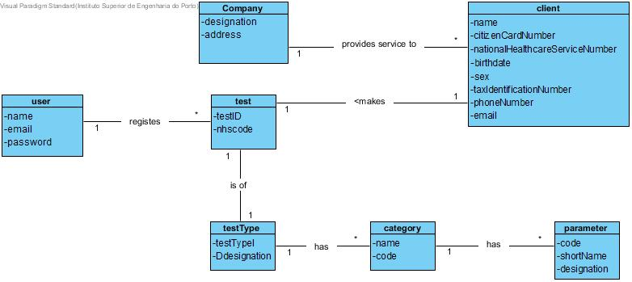
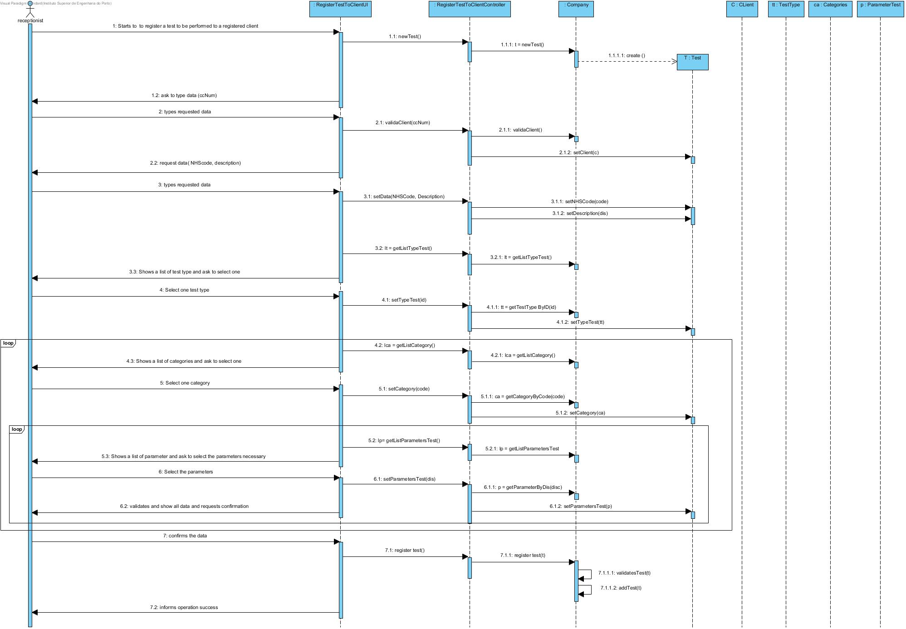

# US 4 - As a receptionist of the laboratory, I intend to register a test to be performed to a registered client.

## 1. Requirements Engineering

### 1.1. User Story Description

 As a receptionist of the laboratory, I intend to register a test to be performed to a
registered cliente.

### 1.2. Customer Specifications and Clarifications 

Each test is characterized by having a unic test code and NHS code.

Each test type is characterized by having a unic id.

Each category is characterized by having a unic code.

Each parameter is characterized by having a unic code.

Each cliente is characterized by having a unic citizenCardNumber.

### 1.3. Acceptance Criteria

AC1: All required fields must be filled in.

### 1.4. Found out Dependencies

there is some dependencies from type of test, category and parameter.

### 1.5 Input and Output Data

##### Input Data:

		.NHS code
		.Description

##### Output Data:
        . Success of the operation.

### 1.6. System Sequence Diagram (SSD)

### 1.7 Other Relevant Remarks

*Use this section to capture other relevant information that is related with this US such as (i) special requirements ; (ii) data and/or technology variations; (iii) how often this US is held.* 

## 2. OO Analysis

### 2.1. Relevant Domain Model Excerpt 
*In this section, it is suggested to present an excerpt of the domain model that is seen as relevant to fulfill this requirement.* 

### 2.2. Other Remarks

*Use this section to capture some aditional notes/remarks that must be taken into consideration into the design activity. In some case, it might be usefull to add other analysis artifacts (e.g. activity or state diagrams).* 

## 3. Design - User Story Realization 

### 3.1. Rationale

**The rationale grounds on the SSD interactions and the identified input/output data.**

| Interaction ID | Question: Which class is responsible for... | Answer  | Justification (with patterns)  |
|:-------------  |:--------------------- |:------------|:---------------------------- |
| Step 1   The receptionist starts to register to be performed to a client |What class interacts with the user? | RegisterTestToClientUI | Pure Fabrication, because it is not justified to assign this responsibility to any class that exists in the Domain Model. |
| | Which class coordinates the US? |  RegisterTestToClientController | Controller |
| | What class creates test? | Company | Creator | 
| Step 2  The system  shows a list of clients and ask to select one | Who knows the clients | Company | Information Expert (IE) |
| Step 3   The receptionist selects a cliente | Where the selected customer is kept | Test |  Information Expert (IE) |
| Step 4   The system request data( NHScode, description) | | | |
| Step 5   The receptionist types requested data | Where are the entered data stored? | test | Information Expert (IE) |
| Step 6   The system Shows a list of test type and ask to select one |	Who knows the test types? | Company |   Information Expert (IE) | 
| Step 7     The receptionist selects a type of test |  Where the selected type of test is kept | Test | Information Expert (IE) | 
| Step 8    The system Shows a list of categories and ask to select one | Who knows the categories? | Company |   Information Expert (IE) | 
| Step 9    The receptionist selects a category |  Where the selected category is kept | Test | Information Expert (IE) | 
| Step 10  The system Shows a list of parameters and ask to select one | Who knows the parameters? | Company |   Information Expert (IE) | 
| Step 11  The receptionist selects a parametr |  Where the selected parameter is kept | Test | Information Expert (IE) | 
| Step 12  The system validates and show all data and requests confirmation | Which class validates the test data (local validation)? |  Test | IE: The Company contains / adds test | 
| Step 13 The receptionist confirms the data | | | 
| Step 14 The system save and informs operation success | What class does the specified / created Test keep? | Company |  IE. In the MD, the Company contains / aggregates Employees |
| | 	What class notifies? | RegisterTestToClientUI | 
 
             

### Systematization ##

According to the taken rationale, the conceptual classes promoted to software classes are: 

 * Company
 * Test

Other software classes (i.e. Pure Fabrication) identified: 

 * RegisterTestToClientUI
 * RegisterTestToClientController

## 3.2. Sequence Diagram (SD)

*In this section, it is suggested to present an UML dynamic view stating the sequence of domain related software objects' interactions that allows to fulfill the requirement.* 

## 3.3. Class Diagram (CD)

*In this section, it is suggested to present an UML static view representing the main domain related software classes that are involved in fulfilling the requirement as well as and their relations, attributes and methods.*

# 4. Tests 
*In this section, it is suggested to systematize how the tests were designed to allow a correct measurement of requirements fulfilling.* 

**_DO NOT COPY ALL DEVELOPED TESTS HERE_**

**Test 1:** Check that it is not possible to create an instance of the Example class with null values. 

	@Test(expected = IllegalArgumentException.class)
		public void ensureNullIsNotAllowed() {
		Exemplo instance = new Exemplo(null, null);
	}

*It is also recommended to organize this content by subsections.* 

# 5. Construction (Implementation)

*In this section, it is suggested to provide, if necessary, some evidence that the construction/implementation is in accordance with the previously carried out design. Furthermore, it is recommeded to mention/describe the existence of other relevant (e.g. configuration) files and highlight relevant commits.*

*It is also recommended to organize this content by subsections.* 

# 6. Integration and Demo 

*In this section, it is suggested to describe the efforts made to integrate this functionality with the other features of the system.*

# 7. Observations

*In this section, it is suggested to present a critical perspective on the developed work, pointing, for example, to other alternatives and or future related work.*

