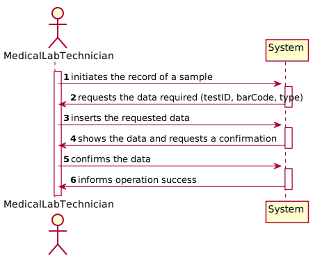
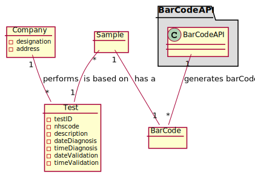
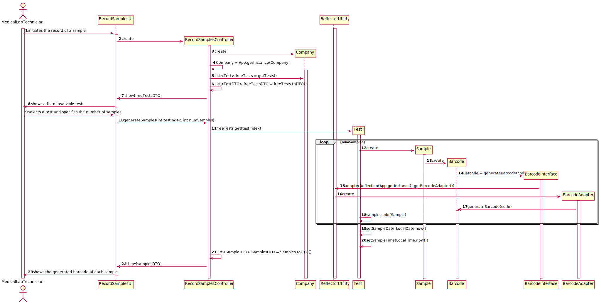
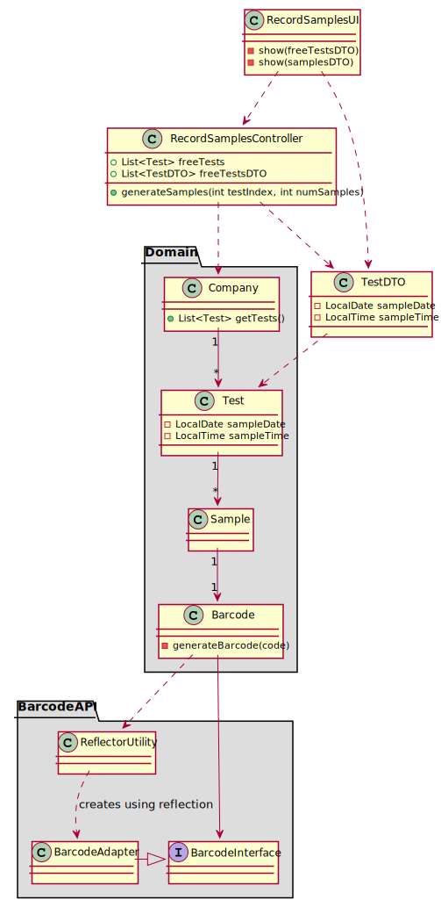

# US5 - Record samples of a test

## 1. Requirements Engineering

### 1.1. User Story Description

As a medical lab technician, I want to record the samples collected in the scope of a given test.

### 1.2. Customer Specifications

Each sample is associated with a test. A sample has only one attribute, a barcode number (UPC) that is a sequential number and is automatically generated by the system. Each sample has a unique barcode number.
The medical lab technician checks the system and see all tests for which there are no samples collected. The medical lab technician selects a test and the system asks for the number of samples to collect.
A test can have more than one sample.

The system should record the date (DD/MM/YYYY) and time (HH:MM) when the sample is collected. The date and time are automatically generated by the system when the barcode is issued.

### 1.3 Clarifications

The medical lab technician checks a list of tests and selects one. Then, the application generates barcodes (one or more). After printing the barcodes (one or more) the use case ends.

### 1.4. Acceptance Criteria

The system should support several barcode APIs. The API to use is defined in the configuration.

### 1.5. Found out Dependencies

### 1.6 Input and Output Data

Output - the record of the samples.

### 1.7. System Sequence Diagram (SSD)

### 1.7 Other Relevant Remarks

## 2. OO Analysis

### 2.1. Relevant Domain Model Excerpt 

### 2.2. Other Remarks

NA

## 3. Design - User Story Realization 

### 3.1. Rationale

**The rationale grounds on the SSD interactions and the identified input/output data.**

| Interaction ID | Question: Which class is responsible for... | Answer  | Justification (with patterns)  |
|:-------------  |:--------------------- |:------------|:---------------------------- |
| Step 1  		 |	... creating a new record Sample?	 |   Test         |  Creator: Test records instances of Samples           |
| Step 3  		 |	... saving the input data?		 |      Controller       |                           |
| Step 5  		 |	... saving the created Samples?						 |    Company      |    IE: records all Test objects which contains Samples                         |
| Step 6  		 |	... informing operation success?						 |       UI      |    IE: responsible for user interaction                         |              

### Systematization ##

According to the taken rationale, the conceptual classes promoted to software classes are: 

 * Company
 * Test
 * Sample
 * Barcode

Other software classes (i.e. Pure Fabrication) identified: 

 - RecordSamplesUI
 - RecordSamplesController
 - TestDTO
 - ReflectorUtility
 - BarcodeInterface
 - BarcodeAdapter
 
ReflectorUtility is used for instantiating objects which its class is only known in runtime - this is needed because the API to use is defined in the configuration file, so the only way to use the API is to run the program so that it can read the configuration file and create the class using reflection.

## 3.2. Sequence Diagram (SD)

## 3.3. Class Diagram (CD)

# 4. Tests 
*In this section, it is suggested to systematize how the tests were designed to allow a correct measurement of requirements fulfilling.* 

**_DO NOT COPY ALL DEVELOPED TESTS HERE_**

**Test 1:** Check that it is not possible to create an instance of the Example class with null values. 

	@Test(expected = IllegalArgumentException.class)
		public void ensureNullIsNotAllowed() {
		Exemplo instance = new Exemplo(null, null);
	}

*It is also recommended to organize this content by subsections.* 

# 5. Construction (Implementation)

*In this section, it is suggested to provide, if necessary, some evidence that the construction/implementation is in accordance with the previously carried out design. Furthermore, it is recommeded to mention/describe the existence of other relevant (e.g. configuration) files and highlight relevant commits.*

*It is also recommended to organize this content by subsections.* 

# 6. Integration and Demo 

*In this section, it is suggested to describe the efforts made to integrate this functionality with the other features of the system.*

# 7. Observations

*In this section, it is suggested to present a critical perspective on the developed work, pointing, for example, to other alternatives and or future related work.*

