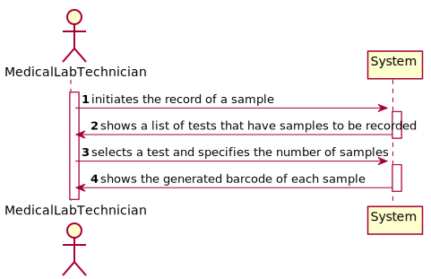

# US5 - Record samples of a test

## 1. Requirements Engineering

### 1.1. User Story Description

As a medical lab technician, I want to record the samples collected in the scope of a given test.

### 1.2. Customer Specifications and Clarifications 

### 1.3. Acceptance Criteria

The system should support several barcode APIs. The API to use is defined in the configuration.

### 1.4. Found out Dependencies

### 1.5 Input and Output Data

Output - the record of the samples.

### 1.6. System Sequence Diagram (SSD)

### 1.7 Other Relevant Remarks

## 2. OO Analysis

### 2.1. Relevant Domain Model Excerpt 

### 2.2. Other Remarks

NA

## 3. Design - User Story Realization 

### 3.1. Rationale

**The rationale grounds on the SSD interactions and the identified input/output data.**

| Interaction ID | Question: Which class is responsible for... | Answer  | Justification (with patterns)  |
|:-------------  |:--------------------- |:------------|:---------------------------- |
| Step 1  		 |	... instantiating a new Client?	 |   Receptionist          |  Creator: Receptionist records instances of Clients           |
| Step 2  		 |		n/a					 |             |                              |
| Step 3  		 |	... saving the input data?		 |      Client       | IE: The object created in step 1 has its own data                             |
| Step 4.1  		 |	... validating the data locally?						 |    Client         | IE: knows its own data                             |
| Step 4.2  		 |	... validating the data globally?						 |    Company         | IE: knows all Client objects                             |
| Step 5  		 |	... saving the created Client?						 |    Company         |    IE: records all client objects                          |
| Step 6  		 |	... informing operation success?						 |       UI      |    IE: responsible for user interaction                         |              

### Systematization ##

According to the taken rationale, the conceptual classes promoted to software classes are: 

 * Receptionist
 * Client
 * Company

Other software classes (i.e. Pure Fabrication) identified: 

 - RegisterClientUI  
 - RegisterClientController
 - MailAdapter
 - AuthFacade
 
MailAdapter is a software class that uses the software adapter in order to asbtract how the MailAPI, responsible for sending email messages (in this the User information to the client's email)
Authfacade is the class responsible, in this case, for creating the User account.

## 3.2. Sequence Diagram (SD)

## 3.3. Class Diagram (CD)

# 4. Tests 
*In this section, it is suggested to systematize how the tests were designed to allow a correct measurement of requirements fulfilling.* 

**_DO NOT COPY ALL DEVELOPED TESTS HERE_**

**Test 1:** Check that it is not possible to create an instance of the Example class with null values. 

	@Test(expected = IllegalArgumentException.class)
		public void ensureNullIsNotAllowed() {
		Exemplo instance = new Exemplo(null, null);
	}

*It is also recommended to organize this content by subsections.* 

# 5. Construction (Implementation)

*In this section, it is suggested to provide, if necessary, some evidence that the construction/implementation is in accordance with the previously carried out design. Furthermore, it is recommeded to mention/describe the existence of other relevant (e.g. configuration) files and highlight relevant commits.*

*It is also recommended to organize this content by subsections.* 

# 6. Integration and Demo 

*In this section, it is suggested to describe the efforts made to integrate this functionality with the other features of the system.*

# 7. Observations

*In this section, it is suggested to present a critical perspective on the developed work, pointing, for example, to other alternatives and or future related work.*

