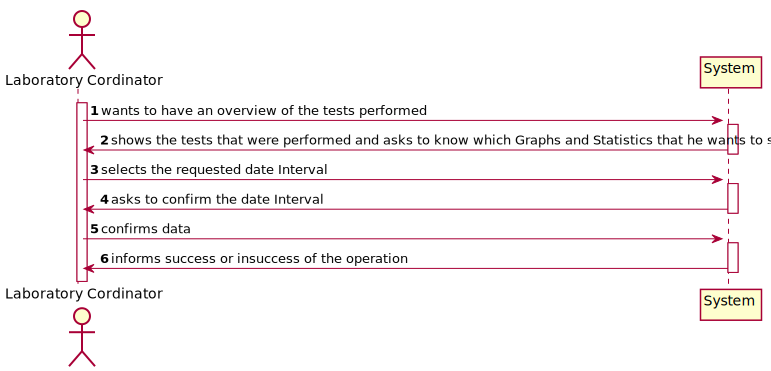
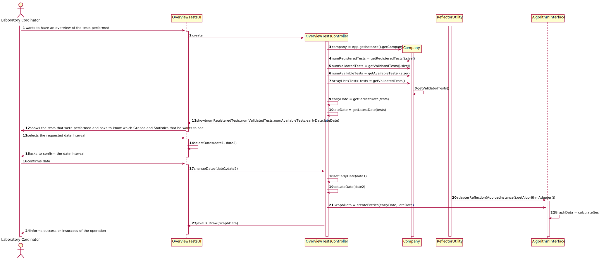
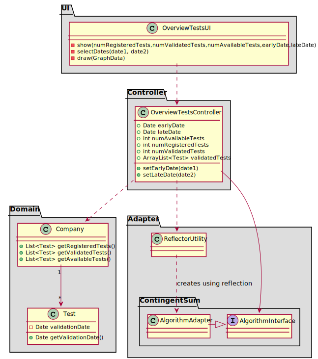

# US 16 - Overview Tests

## 1. Requirements Engineering

### 1.1. User Story Description

As a laboratory coordinator, I want to have an overview of all the tests performed
by Many Labs and analyse the overall performance of the company (for instance, check
the sub-intervals in which there were more samples waiting for the result). To facilitate
overall analysis, the application should also display statistics and graphs.

### 1.2. Customer Specifications and Clarifications 

The laboratory coordinator should be able to check the number of clients,
the number of tests waiting for results, the number of tests waiting for 
diagnosis and the total number of tests processed in the laboratory in each day,
 week, month and year. Moreover, the laboratory coordinator should be able to check 
 the contiguous subsequence with maximum sum.

### 1.3. Acceptance Criteria

While evaluating the performance the laboratory
coordinator should have the ability to dynamically select the algorithm to be
applied from the ones available on the system (the benchmark algorithm provided
in moodle and the brute-force algorithm to be developed). Support for easily
adding other similar algorithms is required.

### 1.4. Found out Dependencies

The domain concept of tests must be fully implemented in order for having tests which are "performed".

### 1.5 Input and Output Data

The chosen graph and statistics can be used with JavaFX, you can draw high quality graphs and there is no need to use other tools.

### 1.6. System Sequence Diagram (SSD)

### 1.7 Other Relevant Remarks

## 2. OO Analysis

### 2.1. Relevant Domain Model Excerpt 

### 2.2. Other Remarks

## 3. Design - User Story Realization 

### 3.1. Rationale

| Interaction ID | Question: Which class is responsible for... | Answer  | Justification (with patterns)  |
|:-------------  |:--------------------- |:------------|:---------------------------- |
| Step 1  wants to have an overview of the tests performed  	 | What class interacts with the user?		|  OverviewTestsUI            |     UI                         |
| Step 2  shows the tests that were performed and asks to know which Graphs	 |							 |       OverviewTestsUI      |        UI                        |
| Step 3  selects the requested date Interval	 |							 |     OverviewTestsUI         |                              | UI
| Step 4  asks to confirm the date Interval		 |							 |       OverviewTestsUI      |                              | UI
| Step 5  confirms data		 |							 |             |       OverviewTestsController                       | Controller 
| Step 6  informs success or insuccess of the operation |							 |             |    OverviewTestsController                          |     Controller         

### Systematization ##

According to the taken rationale, the conceptual classes promoted to software classes are: 

 * Company
 * Client
 * Test

Other software classes (i.e. Pure Fabrication) identified: 
 * OverviewTestsUI  
 * OverviewTestsController
 * ReflectorUtility
 * AlgoithmAdapter
 * AlgorithmInterface

## 3.2. Sequence Diagram (SD)

## 3.3. Class Diagram (CD)

# 4. Tests 
*In this section, it is suggested to systematize how the tests were designed to allow a correct measurement of requirements fulfilling.* 

**_DO NOT COPY ALL DEVELOPED TESTS HERE_**

**Test 1:** Check that it is not possible to create an instance of the Example class with null values. 

	@Test(expected = IllegalArgumentException.class)
		public void ensureNullIsNotAllowed() {
		Exemplo instance = new Exemplo(null, null);
	}

*It is also recommended to organize this content by subsections.* 

# 5. Construction (Implementation)

*In this section, it is suggested to provide, if necessary, some evidence that the construction/implementation is in accordance with the previously carried out design. Furthermore, it is recommeded to mention/describe the existence of other relevant (e.g. configuration) files and highlight relevant commits.*

*It is also recommended to organize this content by subsections.* 

# 6. Integration and Demo 

*In this section, it is suggested to describe the efforts made to integrate this functionality with the other features of the system.*

# 7. Observations

*In this section, it is suggested to present a critical perspective on the developed work, pointing, for example, to other alternatives and or future related work.*

