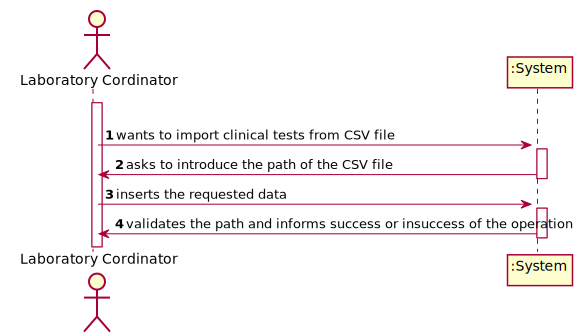
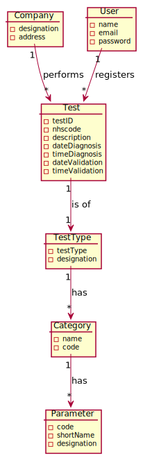
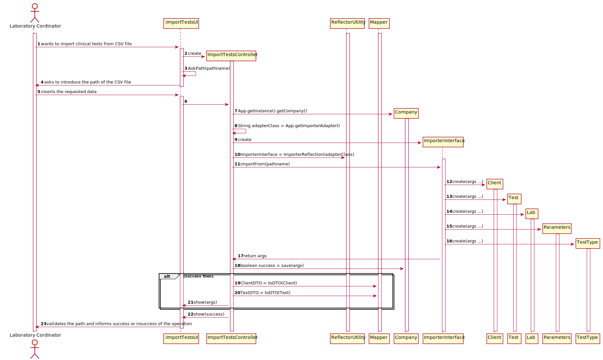
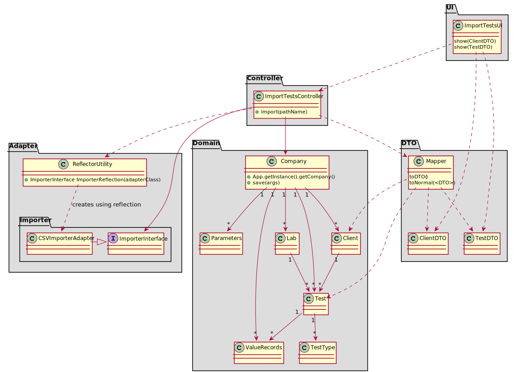

# US 17

## 1. Requirements Engineering

### 1.1. User Story Description

As a laboratory coordinator, I want to import clinical tests from a CSV file.

### 1.2. Customer Specifications and Clarifications

From the document:

From the client clarifications:

"Q: But during the last Sprint you mentioned a registration date also. Considering we could
have more clients than the number that a Many Labs specific laboratory could deal in a day,
then the registration date could be different than the sample collection date. My question
is thus: Should the tests have a registration date plus sample collection date?
A: You should use the Test_Reg_DateHour as the sample collection date."

"Q1:In the CSV files provided for this sprint we can find a parameter with code HDL00 which
belongs to the Cholesterol category and to the blood test type, but by searching the external
modules for the blood test type the team could not find a match for the said parameter. What
can we as a team do to resolve such issue?
A: If the API does not have reference values for this parameter, than you should not present
the reference values to the application user."

"Q1:Will the CSV files always have the same format as the ones available on moodle?
A: Yes. But we can have more categories and parameters for each type of test."

"Q: when importing a test and associating it to the client, should the client exist beforehand or should we import the 
client with the information given on the CSV file?
A: Different from what I asked for the other entities (like the lab), when importing the CSV data, if the client does
not exist in the system, then the client should be created using the data available in the CSV file. "

"Q: When you say tests waiting results are you referring to tests with samples collected but not analyzed yet? If so, 
and considering the csv file does not have an explicit date for when the sample is collected, which date should we use?
A: You should use the test registration date (Test_Reg_DateHour)."

"Q2: (US 17) Should we write some kind of report or should we just leave the report field empty and simply add the date?
A: Leave empty and simply add the date."

"Q1: When loading a .csv file after another .csv has been loaded beforehand, do we keep the tests that were loaded 
previously or do we replace them with the new tests being loaded from the new .csv?
A: The tests should not be deleted after being loaded. "

### 1.3. Acceptance Criteria

If the file contains invalid data (e.g., a parameter not
defined in the system), that data should not be load into the system. An exception
should be thrown

### 1.4. Found out Dependencies

### 1.5 Input and Output Data

Input Data:

    Typed Data: path of the file that wants to upload

Output Data:

    Success or insuccess of the operation

### 1.6. System Sequence Diagram (SSD)

### 1.7 Other Relevant Remarks

## 2. OO Analysis

### 2.1. Relevant Domain Model Excerpt

### 2.2. Other Remarks

## 3. Design - User Story Realization

### 3.1. Rationale

**The rationale grounds on the SSD interactions and the identified input/output data.**

| Interaction ID | Question: Which class is responsible for... | Answer  | Justification (with patterns)  |
|:-------------  |:--------------------- |:------------|:---------------------------- |
| Step 1 wants to import clinical tests from CSV file 		 |		What class interacts with the user?					 |      ImportTestsUI       |   Pure Fabrication, because it is not justified to assign this responsability to any class that exists in the domain model  
|| Which class coordinates the US?                         |ImportTestsController | Controller
| Step 2 asks to introduce the path of the CSV file 		 |							 |             |                              |
| Step 3  inserts the requested data		 |					Where are the entered data stored?		 |   ImportTestsController          |    Information Expert                          |
| Step 4  validates the path and informs success or insuccess of the operation		 |	Which class validates the path?						 |  ImporterInterface            |                             |
|| Which class is responsible for saving the information contained on the imported file? | Company | Information Expert
|| Which class is responsible to inform the success or insuccess of the operation? | ImportTestsUI |

### Systematization ##

According to the taken rationale, the conceptual classes promoted to software classes are:

 * Company
 * Client
 * Test
 * Lab
 * Parameters
 * TestType

Other software classes (i.e. Pure Fabrication) identified:
 * ImportTestsUI  
 * ImportTestsController
 * ReflectorUtility
 * ImporterInterface

## 3.2. Sequence Diagram (SD)

*In this section, it is suggested to present an UML dynamic view stating the sequence of domain related software objects' interactions that allows to fulfill the requirement.*

## 3.3. Class Diagram (CD)

*In this section, it is suggested to present an UML static view representing the main domain related software classes that are involved in fulfilling the requirement as well as and their relations, attributes and methods.*

# 4. Tests
*In this section, it is suggested to systematize how the tests were designed to allow a correct measurement of requirements fulfilling.*

**_DO NOT COPY ALL DEVELOPED TESTS HERE_**

**Test 1:** Check that it is not possible to create an instance of the Example class with null values.

	@Test(expected = IllegalArgumentException.class)
		public void ensureNullIsNotAllowed() {
		Exemplo instance = new Exemplo(null, null);
	}

*It is also recommended to organize this content by subsections.*

# 5. Construction (Implementation)

*In this section, it is suggested to provide, if necessary, some evidence that the construction/implementation is in accordance with the previously carried out design. Furthermore, it is recommeded to mention/describe the existence of other relevant (e.g. configuration) files and highlight relevant commits.*

*It is also recommended to organize this content by subsections.*

# 6. Integration and Demo

*In this section, it is suggested to describe the efforts made to integrate this functionality with the other features of the system.*

# 7. Observations

*In this section, it is suggested to present a critical perspective on the developed work, pointing, for example, to other alternatives and or future related work.*
