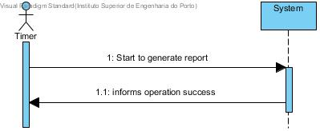
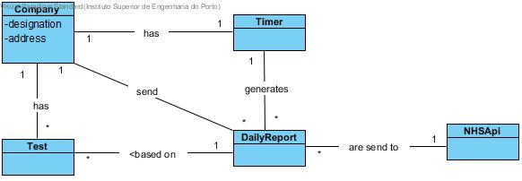
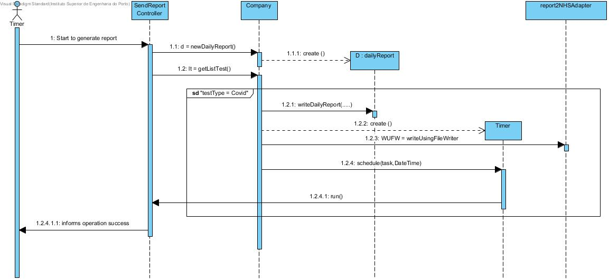
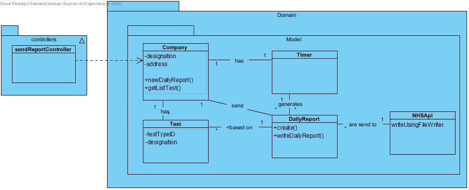

# US 19 - The Many Labs company wants to send to the NHS daily reports os covid-19

## 1. Requirements Engineering

### 1.1. User Story Description

 The Many Labs company wants to send to the NHS daily reports os covid-19

### 1.2. Customer Specifications and Clarifications 

### 1.3. Acceptance Criteria

AC1: The report should include day and week (observed and
estimated) values, the regression model used to estimate each value, R(SLR), R2
and R2 adjusted for SLR and MLR, hypothesis tests for regression coefficients
significance model with Anova. Simple linear and multilinear regression models
can be used to compute the estimates and corresponding confidence intervals.
When the system is configured to use the simple linear regression model, the
performance of each model should be used to select the best model (the one that
uses the number of tests realized or the one that uses the mean age as independent
variable). The best model will be used to make the estimated/expected values that
will be send to NHS. The interval of dates to fit the regression model and the
number of historical points (number of days and number of weeks) must be
defined through a configuration file. The system should send the report using the
NHS API (available in moodle)

### 1.4. Found out Dependencies

there are some dependacies from test 

### 1.5 Input and Output Data

Output Data : 
	
*Success of the operation.*

### 1.6. System Sequence Diagram (SSD)




### 1.7 Other Relevant Remarks

this US happens every day at 6:00 AM.

## 2. OO Analysis

### 2.1. Relevant Domain Model Excerpt 




### 2.2. Other Remarks

*Use this section to capture some aditional notes/remarks that must be taken into consideration into the design activity. In some case, it might be usefull to add other analysis artifacts (e.g. activity or state diagrams).* 



## 3. Design - User Story Realization 

### 3.1. Rationale

**The rationale grounds on the SSD interactions and the identified input/output data.**

| Interaction ID | Question: Which class is responsible for... | Answer  | Justification (with patterns)  |
|:-------------  |:--------------------- |:------------|:---------------------------- |
| Step 1 the timer starts to generat report | What class interacts with the user? |  SendReportController | Controller |
| | Which class coordinates the US? | SendReportController | Controller | 
| | What class creates dailyReport? | Company | Creator | 
| | Who knows the test | Company | Information Expert (IE) |
| | who rites the report | Company | Information Expert (IE) |
| | what class creats timer | Company | Creator |
| | What class sends the report | Company | Information Expert (IE) |
| Step 2  informs operation success | What class notifies?	|       SendReportController        |                              |

### Systematization ##

According to the taken rationale, the conceptual classes promoted to software classes are: 

 * Company
* DailyReport

Other software classes (i.e. Pure Fabrication) identified: 

 * SendReportController 

## 3.2. Sequence Diagram (SD)

*In this section, it is suggested to present an UML dynamic view stating the sequence of domain related software objects' interactions that allows to fulfill the requirement.* 



## 3.3. Class Diagram (CD)

*In this section, it is suggested to present an UML static view representing the main domain related software classes that are involved in fulfilling the requirement as well as and their relations, attributes and methods.*



# 4. Tests 
*In this section, it is suggested to systematize how the tests were designed to allow a correct measurement of requirements fulfilling.* 

**_DO NOT COPY ALL DEVELOPED TESTS HERE_**

**Test 1:** Check that it is not possible to create an instance of the Example class with null values. 

	@Test(expected = IllegalArgumentException.class)
		public void ensureNullIsNotAllowed() {
		Exemplo instance = new Exemplo(null, null);
	}

*It is also recommended to organize this content by subsections.* 

# 5. Construction (Implementation)

*In this section, it is suggested to provide, if necessary, some evidence that the construction/implementation is in accordance with the previously carried out design. Furthermore, it is recommeded to mention/describe the existence of other relevant (e.g. configuration) files and highlight relevant commits.*

*It is also recommended to organize this content by subsections.* 

# 6. Integration and Demo 

*In this section, it is suggested to describe the efforts made to integrate this functionality with the other features of the system.*


# 7. Observations

*In this section, it is suggested to present a critical perspective on the developed work, pointing, for example, to other alternatives and or future related work.*







